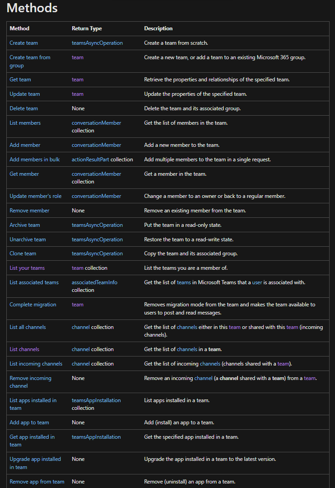
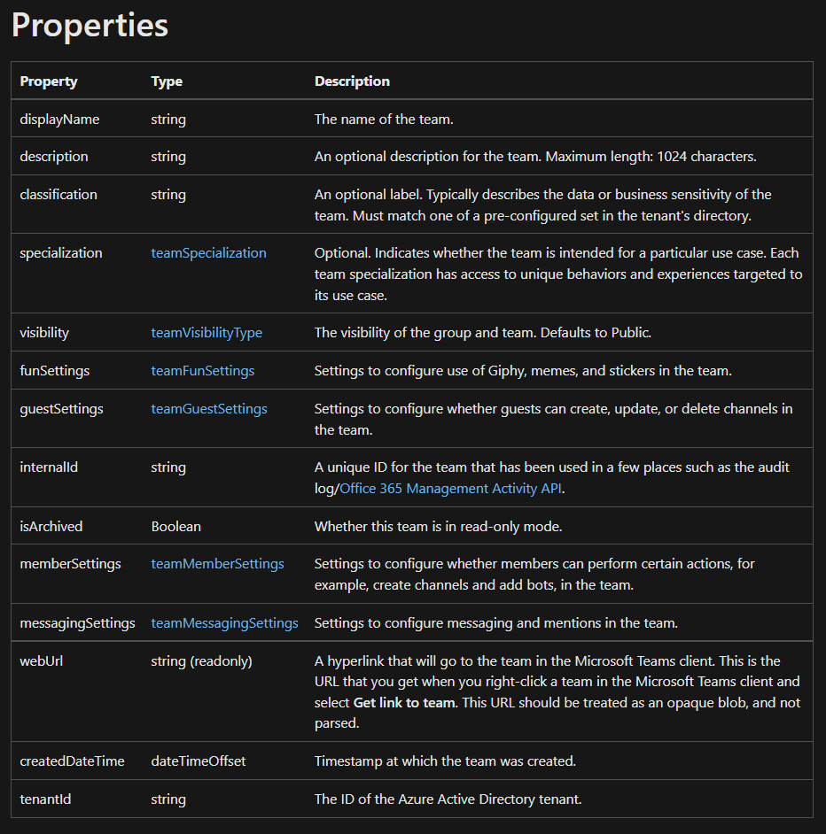

# DOCS

## Main info

**MS Graph Tutorial:** https://docs.microsoft.com/en-us/graph/tutorials/javascript?tabs=aad

**MS Graph Overview:** https://docs.microsoft.com/en-us/graph/overview-major-services

## TeamsAPI

### Main

**MS Graph Teams Overview:** https://docs.microsoft.com/en-us/graph/teams-concept-overview

**MS Graph Teams Use:** https://docs.microsoft.com/en-us/graph/api/resources/teams-api-overview?view=graph-rest-1.0

### **team** resource type

